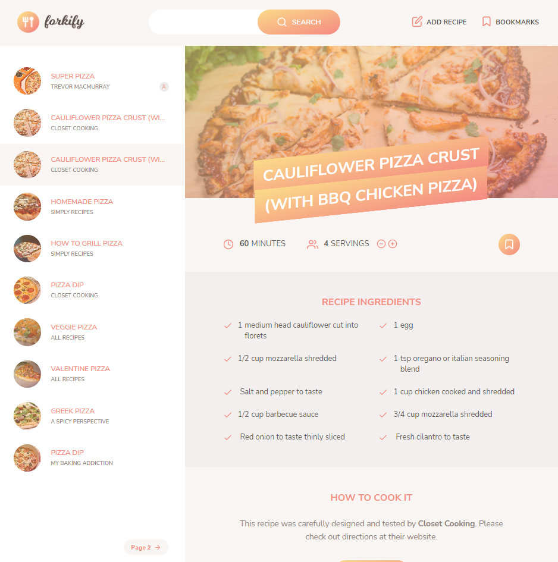

# Forkify App

This is a vanilla javascipt project from the udemy course "The Complete JavaScript Course 2022" It uses an API to search for recipies on the internet based on certain keywords. The recipes can be bookmarked and you can also create your own reciepe.

## What I Learned From This Project

- Async/Await/Promise usage
- use of the Model-View-Controller architecture
- import and export basics for better file organization
- using parcel as a bundler for creating a production build
- how beneficial and efficient frameworks such as react are vs using vanilla javascript for pagination, modals etc.

## Installation

Fork/download the repository and run:

`npm install`

`npm start`

## Screenshots

## Credits

Course created by Jonas Schmedtmann:
[The Complete Javascript Course](https://www.udemy.com/course/the-complete-javascript-course/)
